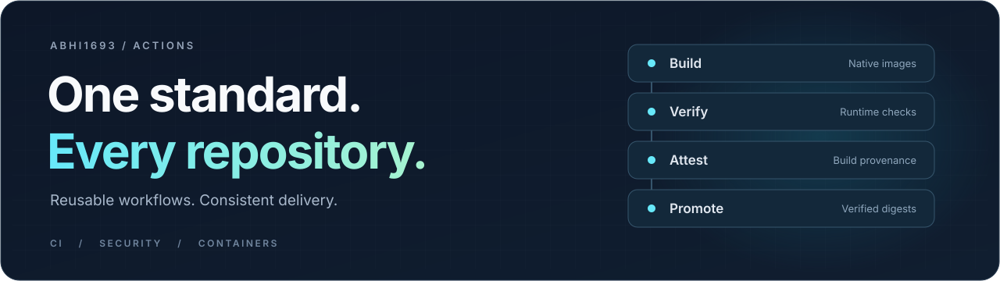

<div align="center">



# Shared GitHub Actions

**A consistent path from source code to verified images.**

Node.js, Python, security checks and container delivery—maintained together,<br> configured by each repository, and versioned through a single shared release process.

[](https://github.com/abhi1693/actions/actions/workflows/validate.yml) [](docs/workflows.md) [](docs/examples/images.json) [](https://github.com/abhi1693/actions/releases)

[**Get started**](#get-started) · [**Explore workflows**](#the-workflow-library) · [**Documentation**](docs/workflows.md) · [**Examples**](docs/examples)

</div>

---

## Built to be shared

A repository should describe what its application needs. The shared workflow should handle how those checks and builds run.

Keep events, application commands and image definitions close to the code. Maintain dependency setup, tool versions, security defaults and publication mechanics here. Every workflow has one supported implementation. Callers move forward together; superseded workflows and compatibility shims are removed.

| Principle | What it means in practice |
| :--- | :--- |
| **One implementation** | Repositories call reusable workflows and supply settings. Common fixes happen here. |
| **Security by default** | Container builds enable SBOMs, maximum-detail provenance, and vulnerability and secret scanning. |
| **Build what changed** | The container suite selects affected components for pushes and PRs, and the complete image set for releases. |
| **Publish what passed** | Final image tags follow verification. Promotion preserves the tested digest. |
| **Keep projects in control** | Application scripts, release triggers, runner choices and explicit exceptions stay configurable. |

## The workflow library

Five reusable workflows cover the common delivery path. Compose them with the project-specific jobs your application needs.

| Workflow | Designed for |
| :--- | :--- |
| [**Node CI**](.github/workflows/node-ci.yml) | Locked npm installs; generation, lint, typecheck, test and build stages; optional database and browser tooling. |
| [**Python CI**](.github/workflows/python-ci.yml) | uv dependency setup, linting, tests and project validation, with optional PostgreSQL and test reports. |
| [**Security**](.github/workflows/security.yml) | Secret scanning, dependency audits, workflow validation and optional CodeQL analysis. |
| [**Container Images**](.github/workflows/container-images.yml) | Component selection, native builds, runtime verification, GitHub attestations and digest-preserving promotion. |
| [**Docker Build & Push**](.github/workflows/docker-build-push.yml) | The shared container builder, also available directly for custom metadata, build secrets and specialized callers. |

## Get started

Add a caller to `.github/workflows/ci.yml`. Point the standard stages at scripts already defined in your `package.json`.

```yaml
name: CI

on:
  pull_request:
  push:
    branches: [master]

permissions:
  contents: read

jobs:
  validate:
    uses: abhi1693/actions/.github/workflows/node-ci.yml@59178a1adfb1547da9ba94fdd46962c510b8eb1f
    with:
      node-version: '24'
      checks: '["lint", "test", "build"]'
      scripts: '{"lint":"lint", "test":"test", "build":"build"}'
```

The example pins a validated commit. The project is in **preview**; a stable `v1` release has not been published yet. After the first release, choose `@v1` for compatible shared updates or an immutable commit SHA for explicit upgrades.

For containers, declare your components in an [image manifest](docs/examples/images.json) and call the [container suite](docs/examples/containers.yml). The manifest describes each image's context, platforms, change paths and optional smoke script.

## Verification before publication

The container suite follows a clear sequence:

**Build → Verify → Attest → Promote**

Build native Linux AMD64 and ARM64 images. Generate SBOMs, scan for vulnerabilities and secrets, and run any application smoke checks. For published suites, attest the verified builds, then promote their exact digests to the final tags.

- **Release tags stay clean.** GitHub release `v1.2.3` produces image tag `1.2.3`.
- **Full versions stay immutable.** A conflicting digest cannot replace an existing full-version tag.
- **Findings remain blocking.** HIGH/CRITICAL vulnerabilities count even when a fix is unavailable.
- **Evidence travels with the build.** Retain scan reports and manifests; published images carry SBOM and provenance attestations.

PR image checks run without publication. Local image checks retain their reports; registry attestations are attached when images are published. See the [workflow contracts](docs/workflows.md) for permissions, supported platforms and explicit configuration options.

## Designed for maintainers

The shared library has its own contract tests and runtime fixtures for Node.js, Python, security checks and containers. Validation covers workflow interfaces, report handling, image selection and promotion; local Docker checks exercise real runtime behavior and digest-preserving retries.

Workflow versions use Git refs. Releases advance the current supported implementation through a validated release process. Breaking changes include a caller migration; older versions remain available in Git history without maintained legacy branches.

| Continue with | What you will find |
| :--- | :--- |
| [Workflow contracts](docs/workflows.md) | Inputs, secrets, security defaults and behavior. |
| [Caller examples](docs/examples) | Starting points for application CI and container manifests. |
| [Maintenance & releases](docs/maintenance.md) | Local validation, versioning, promotion and recovery. |
| [Pull requests](https://github.com/abhi1693/actions/pulls) | Changes under review and a place to contribute improvements. |
